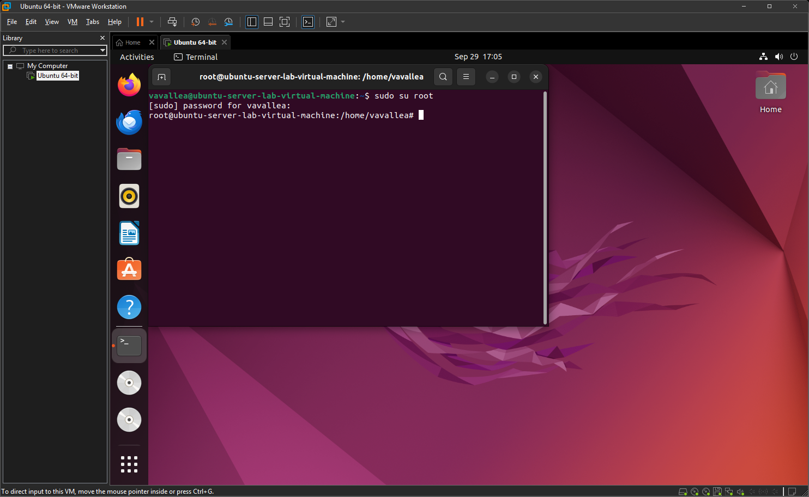

# Environment Variables & Set-UID Program Lab

This lab explores how environment variables affect program and system behavior, especially for privileged (Set-UID) programs. Each task below includes a brief description and a screenshot showing the commands/results.

---

## Task 1 – Manipulating Environment Variables
  
I listed, created, exported, and removed environment variables using `printenv`, `export`, and `unset`. I confirmed that exported variables are visible in a child shell while unset variables are removed. This demonstrates how Bash handles variable inheritance and removal.

---

## Task 2 – Parent and Child Environment
  
  
I compiled and ran a small C program that forks and prints the environment in the child, then captured the parent environment separately. A `diff`/checksum comparison showed no differences, proving the child inherits the parent’s environment copy. This confirms environment propagation across `fork()`.

---

## Task 3 – execve() with NULL vs environ
  
  
I ran a program calling `execve()` first with a `NULL` environment and then passing `environ`. The `NULL` run produced no environment output while the `environ` run printed the full environment list. This shows `execve()` only provides environment variables if they are explicitly passed.

---

## Task 4 – system() Inherits Environment
  
I executed `/usr/bin/env` from a small C program via `system()`, and the output matched the calling shell’s environment. This confirms `system()` invokes a shell (`/bin/sh -c ...`) and thus inherits the caller’s environment. It highlights why calling shell commands can propagate untrusted variables.

---

## Task 5 – Using system() in Set-UID Programs
  
I inspected a Set-UID program that calls `system()` and observed its behavior when executed by a non-root user. The test shows why running shell-based commands from privileged code is risky: the environment and shell behavior can be influenced by the calling user. This task underscores the need to avoid `system()` in security-sensitive code.

---

## Task 6 – PATH Hijacking Vulnerability
  
I created a malicious `ls` script in a user-controlled directory, prepended it to `PATH`, and executed a vulnerable Set-UID program that invoked `system("ls")`. The malicious script ran instead of the system `ls`, demonstrating a classic PATH-hijack. This proves privileged programs must use absolute paths or sanitize the environment.

---

## Task 7 – LD_PRELOAD and Set-UID Protection
  
I built a shared library to override a libc function and used `LD_PRELOAD` to inject it into a normal user program, which showed the overridden behavior. When I ran the same test against a Set-UID binary, the injection failed because the dynamic loader blocks `LD_PRELOAD` for privileged executions. This demonstrates a system protection against runtime library hijacking.

---

## Task 8 – Unsafe `system()` and PATH Interaction
  
I compiled a Set-UID program that calls `system("cat ...")`, replaced `cat` with a malicious script via `PATH`, and observed the malicious script execute. The result demonstrates that `system()` trusts the environment unless it is explicitly cleared, so privileged code should avoid shell invocation or use absolute paths. This highlights an easy route to command hijacking in insecure programs.

---

## Task 9 – Capability Leak (attempt & documentation)
  
  
  
I implemented a capability-leak test intended to open `/etc/zzz` as root, drop privileges with `setuid(getuid())`, and then exec a shell that could still use the opened privileged file descriptor. Compilation/runtime issues (documented in the screenshots) prevented the interactive exploit from completing during this run, but the source, setup, and error logs were captured for reproducibility. This task illustrates how privileged file descriptors can leak capabilities and why careful cleanup is needed after privilege drops.

---

## Brief summary
These experiments demonstrate the mechanics of environment propagation (`fork` and `exec`), the differences between direct execution and shell invocation (`execve` vs `system`), and real-world pitfalls (PATH hijacking, LD_PRELOAD, and capability leaks) that make Set-UID programs particularly sensitive to untrusted environment data. Always run such labs in an isolated VM and use absolute paths or `execve()` for privileged code.

---

