# Environment Variables & Set-UID Program Experiment

This experiment shows how environment variables affect program and system behavior, especially for privileged Set-UID programs. Every task below includes a brief description and a screenshot showing the commands/results.

---

## Task 1 – Manipulating Environment Variables

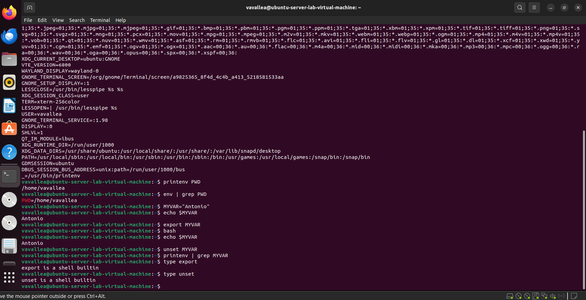
I used `printenv`, `env`, `export` and `unset` to list and create enviroment variables. I created MYVAR by using `export` and `echo $MYVAR` and removed it with `unset`.

---

## Task 2 – Parent and Child Environment
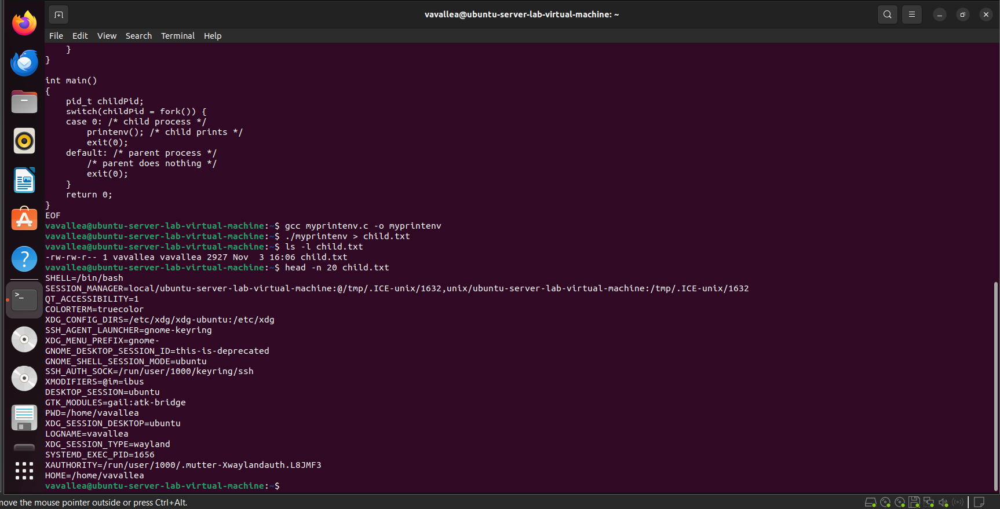  
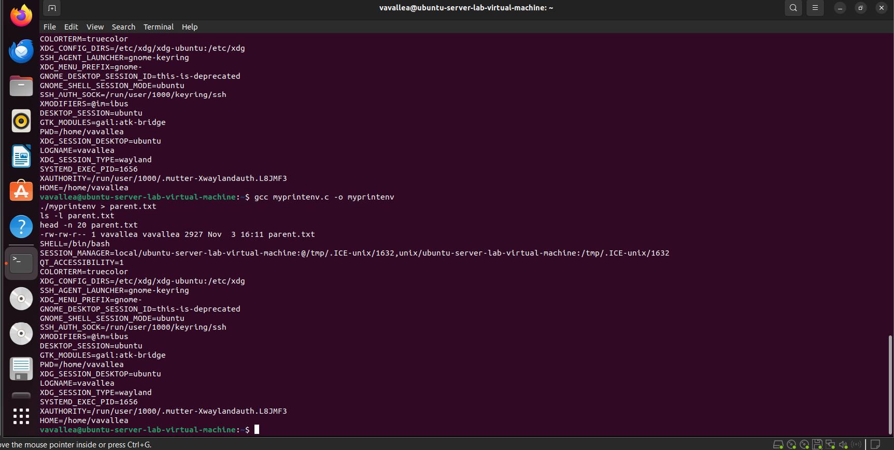 
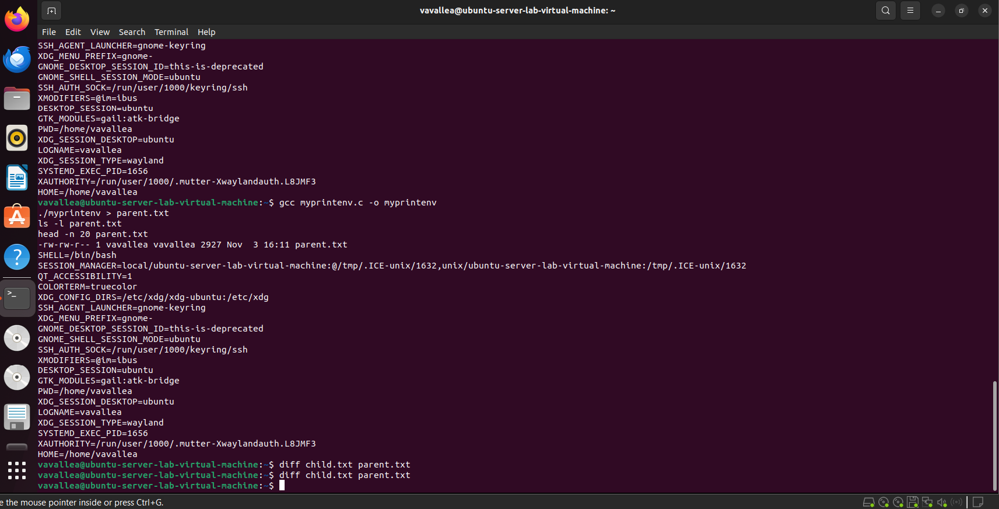
I compiled and ran a small C program that forks and prints the environment in the child, then directed the parent environment separately. A `diff` comparison showed no differences This shows that the child inherits the parent’s environment copy. This confirms `fork()` functionallity.

---

## Task 3 – execve() & Enviroment Variables
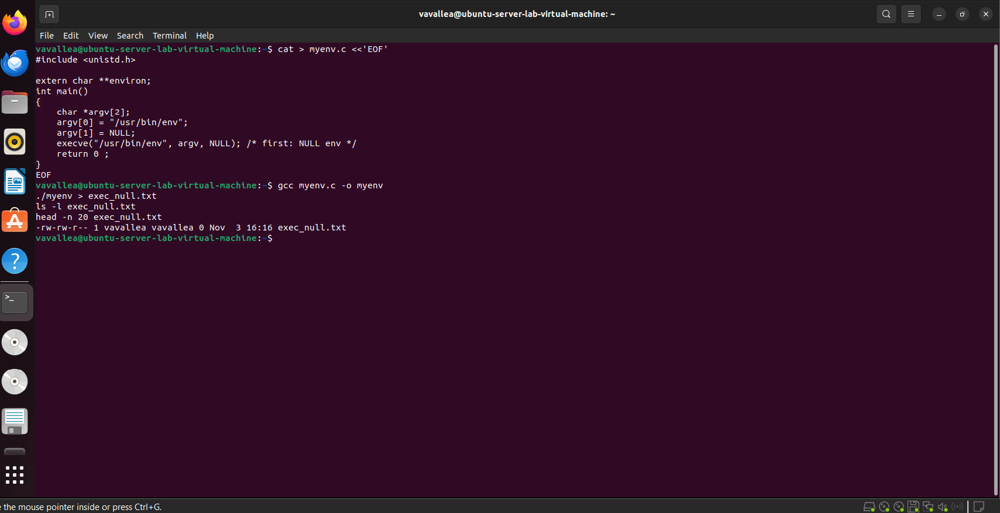  
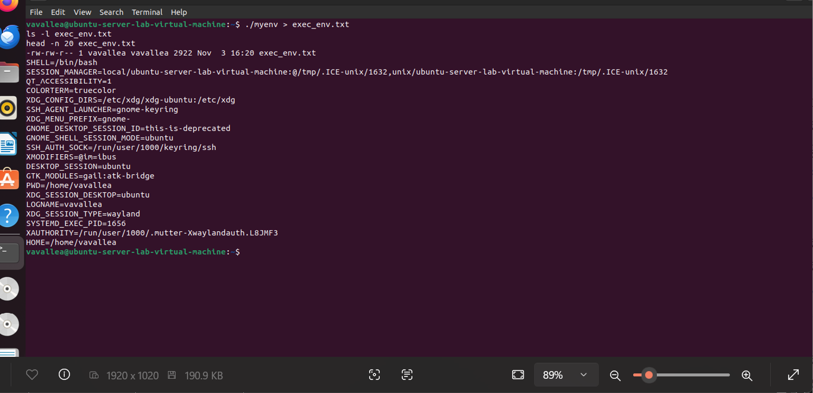  
I ran a program calling `execve()` first with a NULL environment and then passing `environ`. The NULL run produced no environment output, but the `environ` run printed the full environment list. This shows `execve()` only provides environment variables if they are specifically passed.

---

## Task 4 – system() & Enviroment Variables
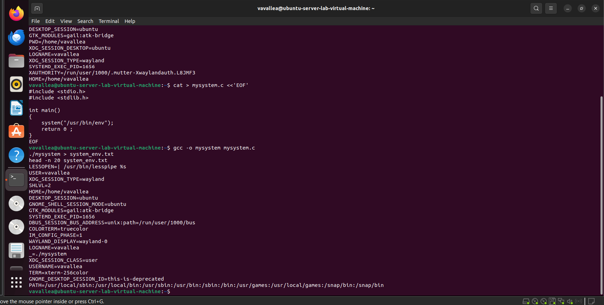  
I executed `/usr/bin/env` from a small C program by dangerously using the system function and the output matched the calling shell’s environment. This confirms `system()` invokes a shell following the path and by doing so, inherits the caller’s environment. It highlights why calling shell commands using system can be risky.

---

## Task 5 –  Set-UID Programs and Enviroment Variables
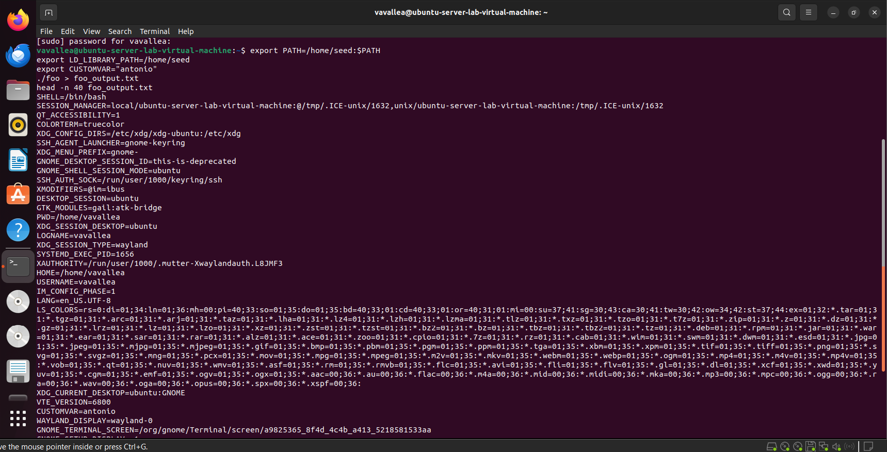  
by creating a printing program named foo.c and using these commands:  
`gcc foo.c -o foo  
sudo chown root:root foo  
sudo chmod 4755 foo`  
these commands allowed me to set privledges to foo and make it a set-UID, I then ran:  
`./foo > foo_output.txt  
head -n 40 foo_output.txt`  
and expected some enviroment variables to be missing due to the set-UID process.

---

## Task 6 – PATH Hijacking Vulnerability
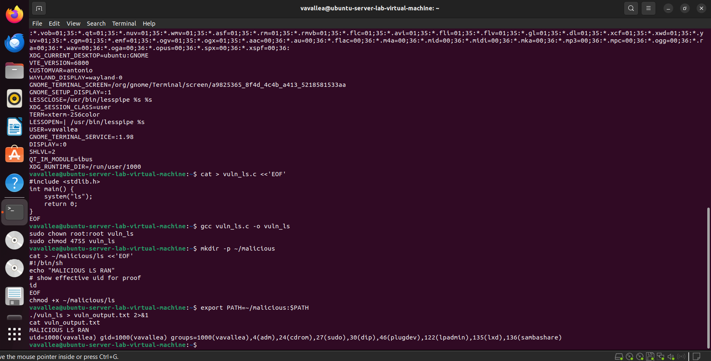  
I created a malicious script in a user-controlled directory directed it to PATH and executed a vulnerable Set-UID program that invoked `system("ls")`. The malicious script ran instead of the system `ls`, demonstrating a classic PATH-hijack. This proves just how dangerous using system calls in scripts can be.

---

## Task 7 – LD_PRELOAD and Set-UID Protection
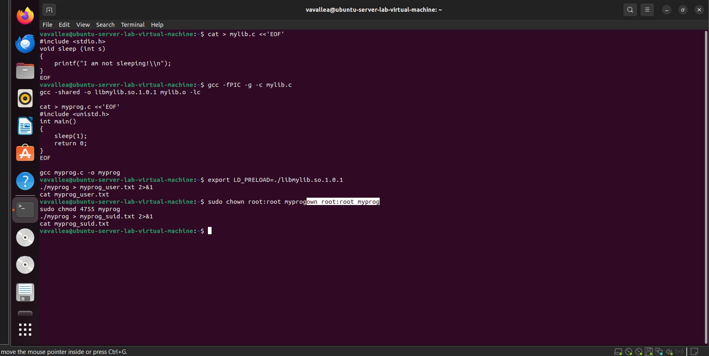  
I built a shared library to override a libc function and used `LD_PRELOAD` to inject it into a normal user program, which showed the overridden behavior. When I ran the same test against a Set-UID binary, the injection failed because the dynamic loader blocks `LD_PRELOAD` for privileged executions. This demonstrates a system protection against runtime library hijacking.

---

## Task 8 – system() vs execve()
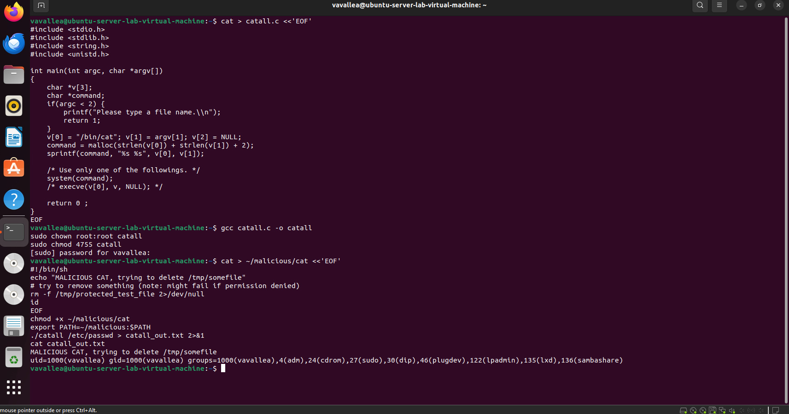  
I compiled a Set-UID program that calls `system("cat ...")`, replaced `cat` with a malicious script via `PATH`, and observed the malicious script execute. The result demonstrates that `system()` trusts the environment unless it is explicitly cleared, so privileged code should avoid shell invocation or use absolute paths. This highlights an easy route to command hijacking in insecure programs.

---

## Task 9 – Capability Leak
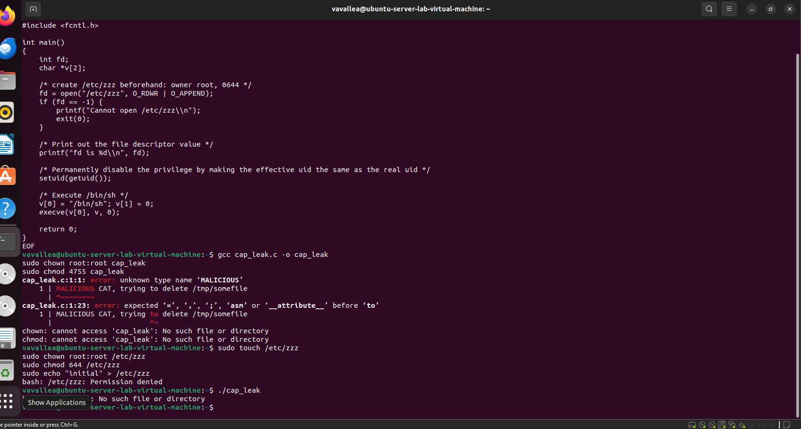   
I implemented a capability-leak test intended to open `/etc/zzz` as root, drop privileges with `setuid(getuid())`, and then exec a shell that could still use the opened privileged file descriptor. Compilation/runtime issues (documented in the screenshots) prevented the interactive exploit from completing during this run, but the source, setup, and error logs were captured for reproducibility. This task illustrates how privileged file descriptors can leak capabilities and why careful cleanup is needed after privilege drops.

---

