# Crucial Commands in Linux

---
# User Tasks

## 1. Switch to root

---

## 2. Create users bobby and sally
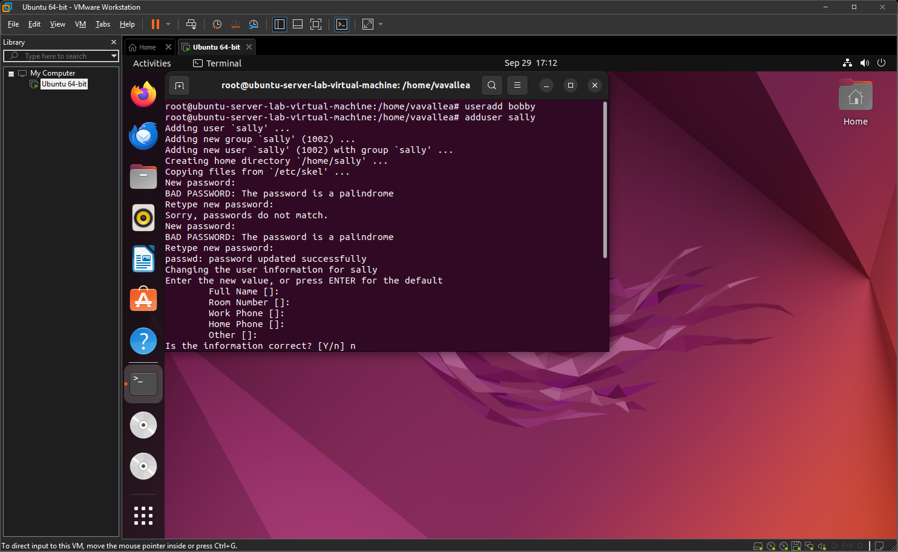
useradd = It just creates the user account with minimal defaults. It doesn't set up a password, home directory, or shell  
adduser = it asks for details like password, full name, and sets up the home directory automatically

---

## 3. Switch to sally
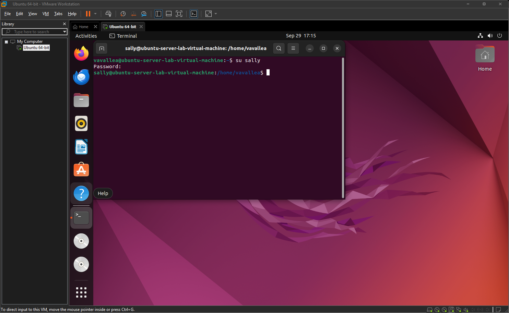

---

## 4. Try creating a user as sally
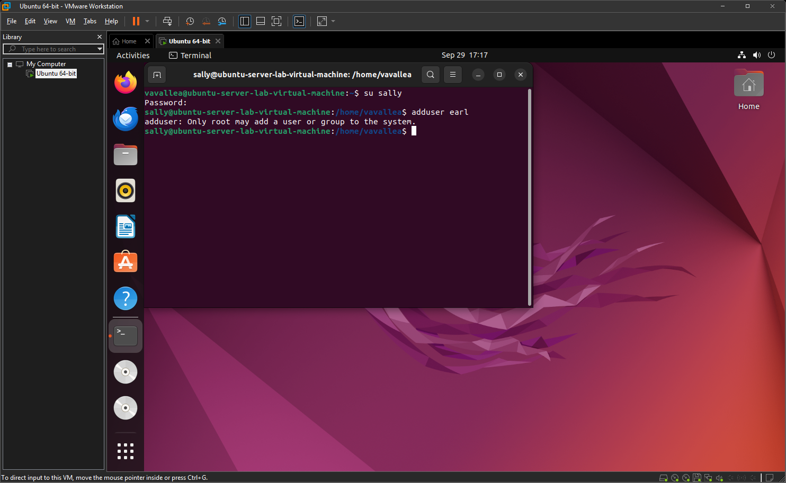
This is because sally does not have root access and is not root user

---

## 5. Create then Delete user earl
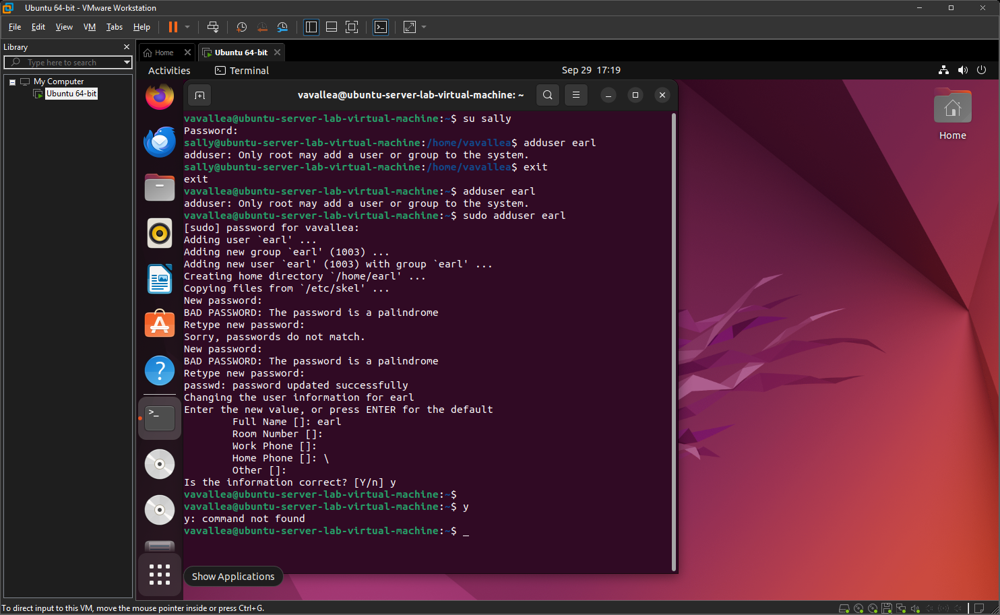

---

## 6. Change sally's password
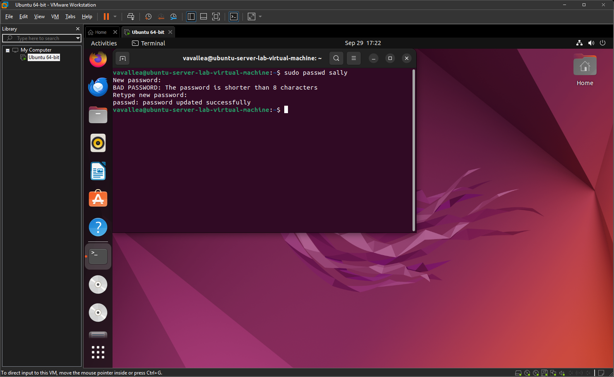

---

## 7. Why not stay logged in as root?
Every command runs with full system privileges. A simple typo could destroy the whole system

---

## 8. Show user ID

---

# Group Tasks

## 9. Give sally sudo access and use that access to create new user earl
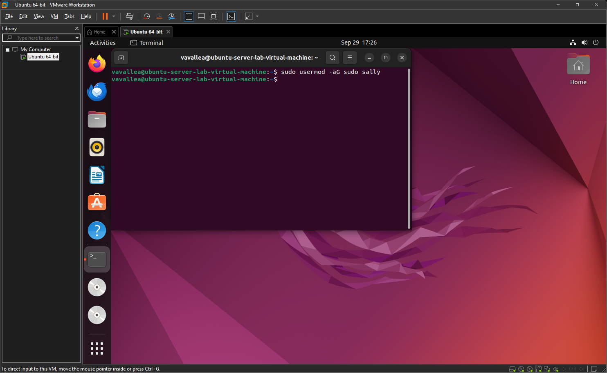
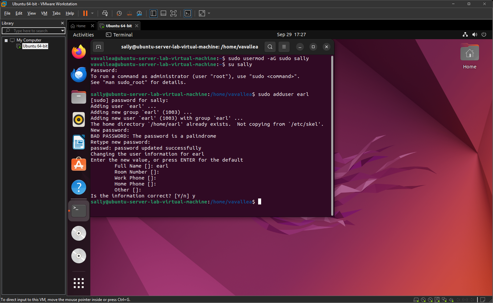

---

## 10. Create cybersec group, add sally to cybersec and check sally's groups
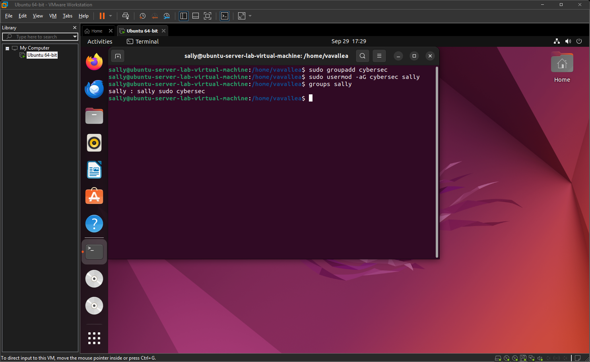

---

# Permissions and ACL Tasks

## 11. Create lab1 directory
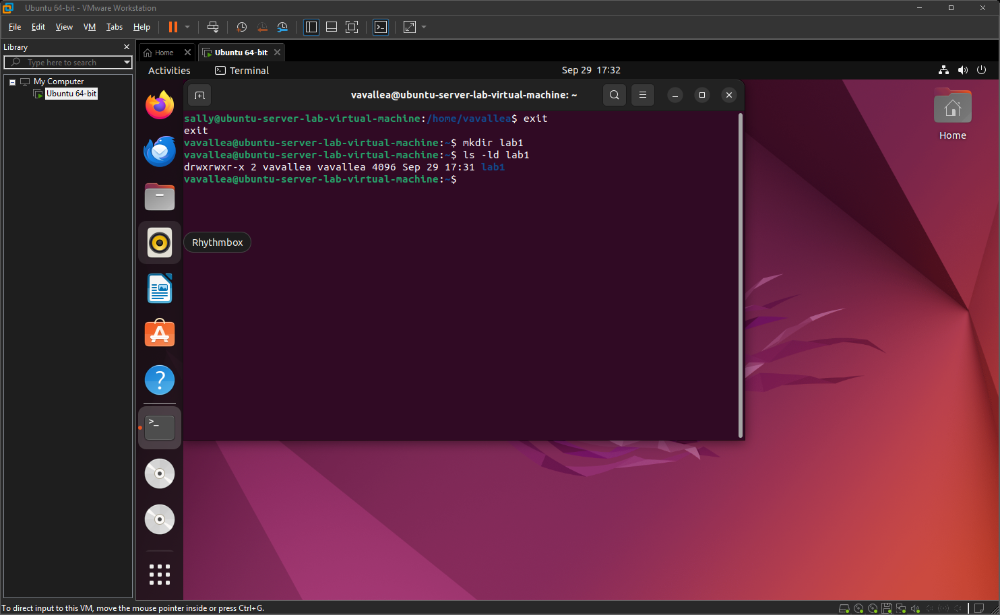
Owner = vavallea    
Group owner = vavallea  
The owner and group have read and write and execute perms  
Other has read and execute perms but no write

---

## 12. Create helloWorld script, make it executable and run helloWorld script
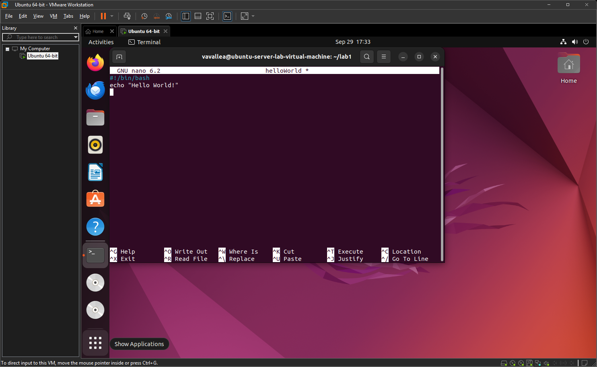
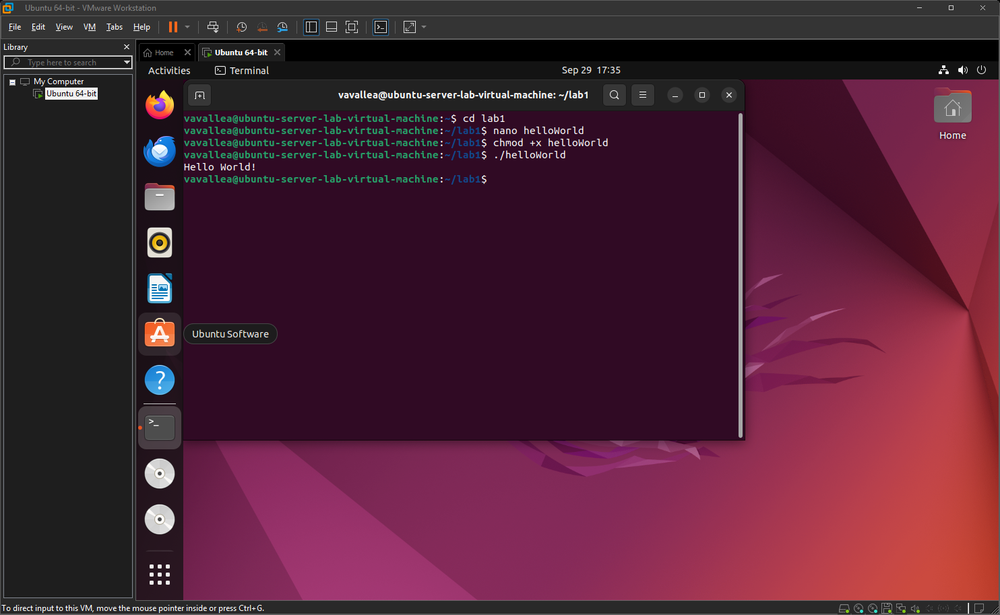

---

## 13. Check and modify helloWorld permissions and view ACL of helloWorld
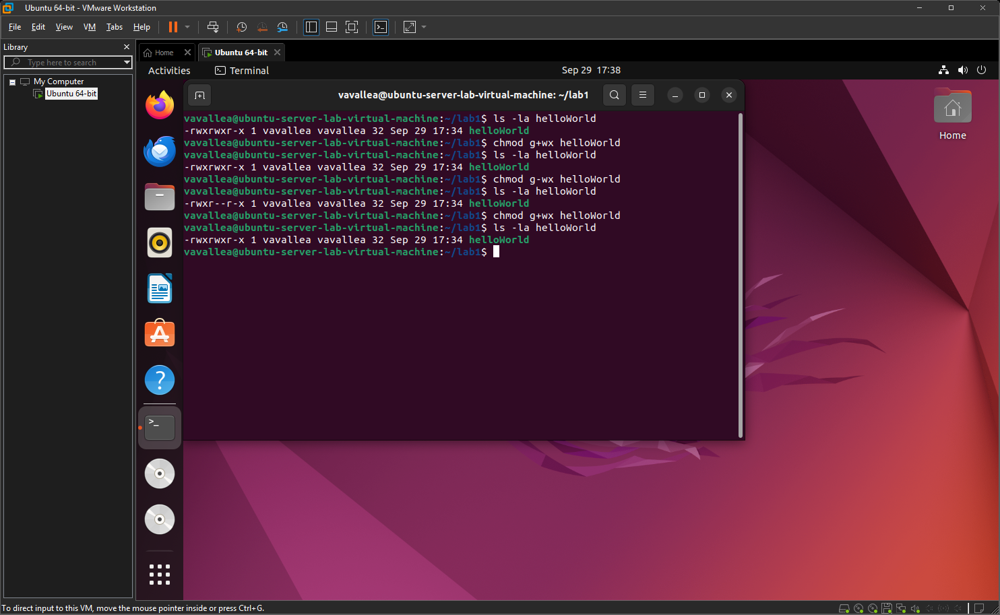
The permissions for this file are as follows:   
owner: read, write and execute    
group: read, write and execute    
other: read and execute

---

## 14. Give sally read & write access using setfacl then check with getfacl
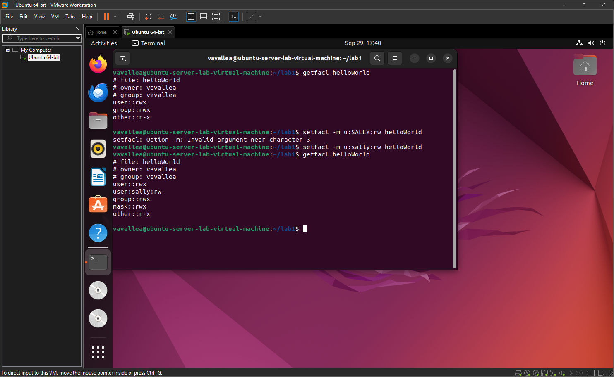

