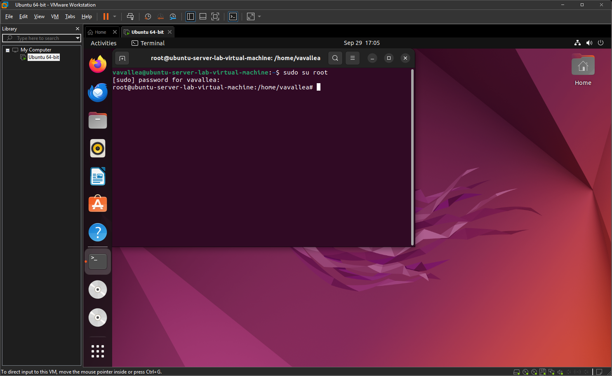

# Crucial Commands in Linux

---
# User Tasks

## 1. Switch to root

---

## 2. Create users bobby and sally

useradd = It just creates the user account with minimal defaults. It doesn't set up a password, home directory, or shell  
adduser = it asks for details like password, full name, and sets up the home directory automatically

---

## 3. Switch to sally

---

## 4. Try creating a user as sally

This is because sally does not have root access and is not root user

---

## 5. Create then Delete user earl

---

## 6. Change sally’s password

---

## 7. Why not stay logged in as root?

---

## 8. Show user ID

---

# Group Tasks

## 9. Groups ubuntu belongs to

---

## 10. Give sally sudo access

---

## 11. Create cybersec group

---

## 12. Add sally to cybersec

---

## 13. Check sally’s groups

---

# Permissions and ACL Tasks

## 14. Create lab1 directory

---

## 15. Create helloWorld script

---

## 16. Check and modify helloWorld permissions

---

## 17. View ACL of helloWorld

---

## 18. Give sally read & write access

